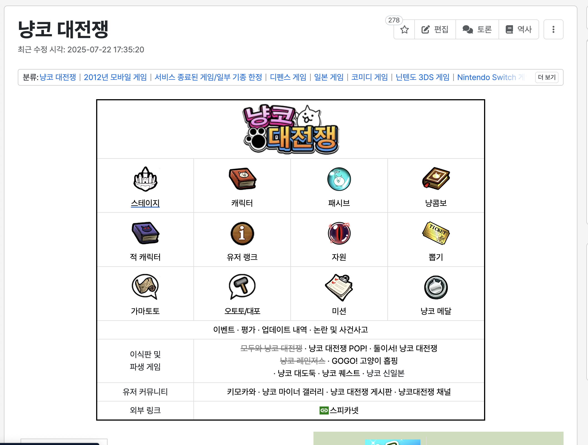
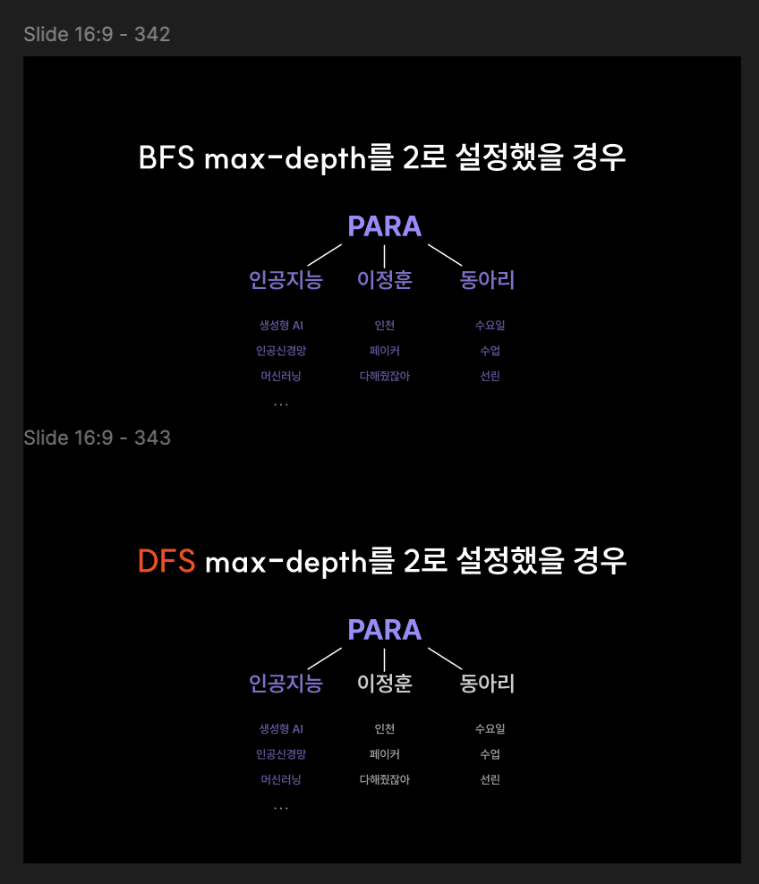

RAG에 대해서 공부하다가 문득 그런 생각이 들었다.

"흠.. 내가 원하는 도메인의 정보를 다 때려 넣을 수 있으면 좋겠는데..."

만약 내가 원하는 도메인의 데이터만 가져올 수 있다면... 내가 즐기는 게임, 애니메이션, 만화의 IP에 특화된 RAG를 구축할 수 있지 않을까하는 생각이 들었다.

<br>

> 가장 먼저 떠오른건 **위키(Wiki)** 였다.

위키피디아나 나무위키와 같은 위키는 문서 양이 방대해서, 대부분의 경우에 어느 도메인이건 가리지 않고 자세하게 설명되어있다.

그렇다고 위키에 등록되어있는 문서들 중에서 내가 원하는 도메인의 모든 문서를 일일이 하나하나 다 수작업으로 수집하는 것은 너무 오래걸리고 힘든 일이다.



위 사진과 같이 하나의 게임에 대해서 수 많은 문서들이 존재하는데 이것을 수작업으로 작업한다는건... ~~끔찍하다~~

<br>


이러한 노동집약적 문제를 해결하기 위해서 문서 데이터를 수집하는 것을 **셀레니움(Selenium)을 사용한 동적 크롤링으로 자동화** 하기로 했다.

근데... 크롤링을 하는데 어떻게 해야할까? 현재로 정해진 기준은 아무 것도 없다.

<br>

그러던 도중 알고리즘 수업시간에 배?운 그래프 탐색 알고리즘들이 생각났다. ~~사실 이미 알고 있었다~~

여기서 핵심 아이디어가 나오게 된다.

### **위키 자체를 거대한 그래프로 보고, 문서를 노드로, 문서에 있는 하이퍼링크를 간선으로 취급하자!**
도메인의 root가 되는 문서를 하나 정해주면, 그 하이퍼링크에 연결된 문서들은 root 문서와 관련된 문서들이기 때문에 도메인 동일성이 어느정도 보장 된다고 볼 수 있다.

<br>


---

그래프 탐색 알고리즘에는 크게 BFS(넓이 우선 탐색)과 DFS(깊이 우선 탐색)이 있는데,

지금의 경우에는 **BFS를 적용** 하는 것이 맞다고 생각했다. 아래 사진은 학교에서 발표했을 때 사용한 자료의 일부이다. 



BFS에서 max-depth를 2로 설정했을 때에는 PARA에 관련된 문서들이 골고루 수집된 것을 볼 수 있는데,

DFS에서 max-depth를 2로 설정했을 때에는 인공지능에 관련된 문서들만 편향적으로 수집 되었다.

<br>

이것이 내가 BFS를 선택한 이유이다. 깊이를 우선으로 할 경우에는 탐색 경로가 특정 가지로만 빠질 수 있기 때문이다.

특정 가지로 빠지게 된다면, 내가 원하는 root 문서의 도메인의 대해서 폭넓게 데이터를 수집할 수 없는 것이다.

---

아래는 내가 구현한 BFS로 위키 문서를 크롤링하는 코드이다.

실제 작동하는 코드는 아니고 보기 좋게 추상화를 시킨 코드이다.


```python
def bfs_crawl(self, start_url, start_title, max_depth=2):

    queue = [(start_title, start_url)]
    results = []

    for depth in range(max_depth + 1):
        if not queue:
          break

        current_level = list(set(queue))
        queue.clear()

        for title, url in current_level:
            print(f"[Depth {depth}] {title}")
            self.driver.get(url)

            # 문서 본문 가져오기
            content = WebDriverWait(self.driver, 10).until(
                EC.presence_of_element_located((By.XPATH, '본문 XPath'))
            )

            # 표 및 광고 요소 제거
            self.driver.execute_script("...표 제거 JS...", content)
            self.driver.execute_script("...광고 제거 JS...", content)

            # 문서 텍스트 저장
            results.append((title, content.text))

            # 내부 링크 수집
            links = content.find_elements(By.XPATH, './/a')
            for link in links:
                linked_title = link.get_attribute('title')
                linked_url = link.get_attribute('href')

                if self._is_valid_link(linked_title, linked_url, title):
                    queue.append((linked_title, linked_url)) # 큐에 탐색할 노드 추가

    return results

```

기본적인 BFS 구현에서 그래프가 위키로 바뀌었고, 위키 문서의 내부의 데이터를 처리하는 부분 말고는 크게 다른 것은 없다.

~~방문노드처리하는거깜빡ㅎㅎ~~

---

코드는 실제로 잘 작동했고, 본래 목적에 맞게 RAG 파이프라인까지 구축하도록 간단한 프로그램을 만들었다.

아래는 github repo와 작동 영상이다.

::github{repo="GonGe1018/Wiki-RAG"}

<iframe width="100%" height="468" src="https://www.youtube.com/embed/M9kzcWVkmiE" title="YouTube video player" frameborder="0" allow="accelerometer; autoplay; clipboard-write; encrypted-media; gyroscope; picture-in-picture; web-share" allowfullscreen></iframe>


---

다 만들고 보니 몇가지 개선할 문제점이 발견 되었다.

<br>

1. #### 큐에 추가되는 문서가 root 문서의 도메인과 동일함을 보장할 수 없다.
  - 이유 : 하이퍼링크를 농담을 위해서 쓰기도하고, 동음이의어와 혼동을 방지하기 위해서 하이퍼링크를 사용하기 한다.
  - 해결 방법 : LLM을 사용해서 같은 도메인인지 판단시키는 방법이 있을 것이다. 물론 이 방법은 LLM에게 학습되지 않은 도메인의 경우 혼동이 일어날 수 있겠지만, 적어도 완전 관련 없는 문서는 배제할 수 있을 것이다.

<br>

2. #### depth가 깊어지면 탐색이 너무 느려진다.
  - 이유 : 셀레니움을 사용한다는 것은 실제 브라우저를 켜서 동적으로 크롤링하는 것을 의미하기에, 어쩔 수 없는 문제이다. 게다가, 위키 사이트 자체에서 봇을 사용한 데이터 수집을 제한하기 위해서 각종 장치를 도입해서 더 느려지는 것도 있을 것이다. 1번 문제와 중복으로 도메인과 관련 없는 문서가 마구마구 큐에 추가 되어서 느려지는 이유도 있다.

<br>

일단 확실하게 필요한 것은...  ~~깜빡한 방문노드 처리~~

큐에 추가되는 문서의 도메인 동일성을 판단하는 것이다. 실제로 탐색을 돌려봤을 때 농담과 부연 설명을 위한 문서가 너무 많이 추가 되어서 수집된 데이터의 도메인이 흐려지는 문제가 발생했다.

---

수업시간에 배운 내용을 내 필요한 용도에 맞게 고민하고, 가공해서 사용한 경험이라서 좋은 경험을 했다고 생각한다.

오랜만에 재밌는 미니 프로젝트였다.