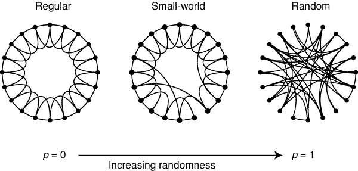
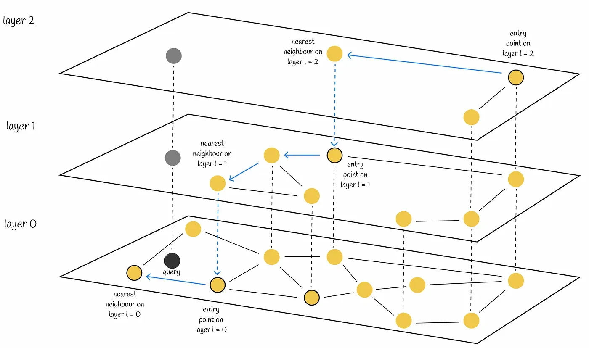

> 원본은 2025년 7월 16일에 작성되었습니다

이전에 RAG에 대해서 공부를 하다가 메타에서 만든 벡터 검색 라이브러리, FAISS를 사용한 적이 있다.<br>
나는 내가 사용하는 기술이 어떻게 동작하는지 이해하지 못하면 불안해하는 타입이라 FAISS와 라이브러리가 어떻게 벡터를 검색하는지 열심히 공부했다.

그중에서 몇가지 오늘날 벡터 검색을 대표하는 이론과 알고리즘을 소개하려고 한다.

<br>

**“나랑 연예인은 몇번의 인연을 거쳤을 때 닿게 될까?”** 이런 생각을 누구나 한 번쯤 해보았을 것이다.<br>
연예인과 나는 절대로 닿을 수 없을 것 같지만, 사실 알고보면 아무리 많아도 6단계만 거치면 연예인에게 닿을 수 있다.

더 극적인 예시를 들어보겠다. 선린인터넷고의 평범한 학생인 유채호와 미국 대통령은 사실 6단계만 거치면 만날 수 있다.
```
1. 선린인터넷고등학교 소프트웨어과 학생 유채호
2. 유채호를 지도하는 선린인터넷고등학교의 교사A
3. 교사A의 오랜친구 대학 교수B
4. 교수B와 학회에서 만난 미국인 교수C
5. 교수C와 정책을 연구한 미국 고위공무원D
6. 고위공무원D의 보고를 받는 미국 대통령
```
유채호 학생은 미국 대통령이 아니라 어느 국가의 원수와도 닿을 수 있을 것이다.

<br>

이를 설명하는 이론으로 `small-world network`가 있다.

만약 인간 관계를 나타낸 그래프가 있다고 해보자, 이 그래프에서 사람 한명은 균일하게 근처의 10명만 알고 지낸다. 근처의 사람들만 알고 지내기 때문에 멀리 있는 사람과 닿으려면 상당한 간선을 거쳐야한다.

만약 여기서 랜덤하게 몇명의 사람들을 멀리 있는 사람들과 연결 시키면 어떻게 될까? 아주 멀리 떨어져 있더라도 적은 수의 간선을 통해서 목표한 곳까지 도달할 수 있을 것이다.

이것을 고속도로와 지방도로 이해하기 쉬운데, **멀리 있는 사람들과 연결된 간선은 일종의 고속도로가 된 셈이고, 가까운 사람끼리 이어진 간선은 지방도**로 볼 수 있다.

이것은 아무리 거리가 먼 노드라고 할지라도 중간에 빠르게 이어주는 몇개의 고속도로를 찾으면 빠르게 목표까지 도달 할 수 있다는 것을 의미한다.

이러한 형태의 네트워크를 small-world network라고 부른다. 이 내용은 1997년 네이쳐지에 게재된 Collective dynamics of‘small-world’ networks 논문에서 설명되었다.

<br>

이러한 small-world network 이론은 벡터 검색에 사용될 수 있는데 대표적인 예시가 `HSNW(Hierarchical Navigable Small World graphs)`알고리즘이다.

이 알고리즘은 small-world 이론을 활용한 알고리즘으로, 마찬가지로 그래프 기반으로 검색을 하게 된다.



대표적인 특징은 그래프가 **여러 계층(layer)로 구성**되어 있는 것이다. 이러한 층은 서로 연결 되어있다.

가장 위의 층의 그래프는 이전에 설명한 small-world 예시처럼 고속도로의 역할을 한다. 각 벡터 노드들을 랜덤하게 이어서 각 벡터들 간에 거리가 긴 고속도로가 생기게 된다.

**위층부터 아래층으로 내려갈 수록 그래프에 이어진 벡터 노드들은 많아지고 간선은 더 촘촘해져 고속도로에서 지방도에 가까워진다.**

<br>

HNSW 알고리즘의 검색을 쉽게 비유해보겠다. 예를 들어서 서울에서 부산에 있는 자갈치시장을 찾아가는 경우는 아래와 같이 표현할 수 있다.
```
1. 서울역에서 KTX로 부산역까지 이동 (고속 이동)
2. 부산역에서 지하철로 남포역까지 이동 (좀 더 촘촘한 이동)
3. 남포역에서 도보로 자갈치시장까지 이동 (정밀하게 최종 목적지 도달)
```

이러한 비유는 아래와 같은 설명에 대응될 수 있다.
```
1. layer2에서 검색 대상과 가까운 노드로 이동한다
2. layer1에서도 한번 더 검색 가까운 노드로 이동한다.
3. layer0에서 검색 검색 노드에 근사하여 도달한다.
```

<br>

HNSW 알고리즘은 이처럼 계층적 small-world 그래프를 빌드하여 대규모 데이터에도 적은 단계로 빠르게 검색 대상에 도달 할 수 있다.

또한, 속도와 정확도를 모두 잡은 대표적인 알고리즘으로써, FAISS 이외에도 대부분의 벡터DB의 검색 알고리즘으로 사용되고 있다.