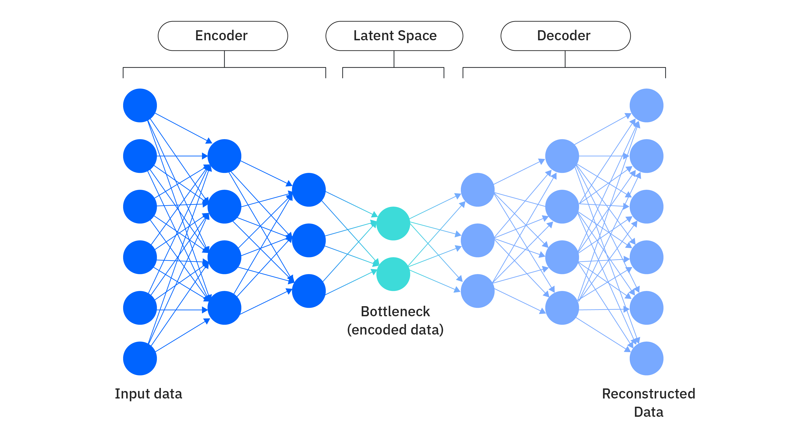
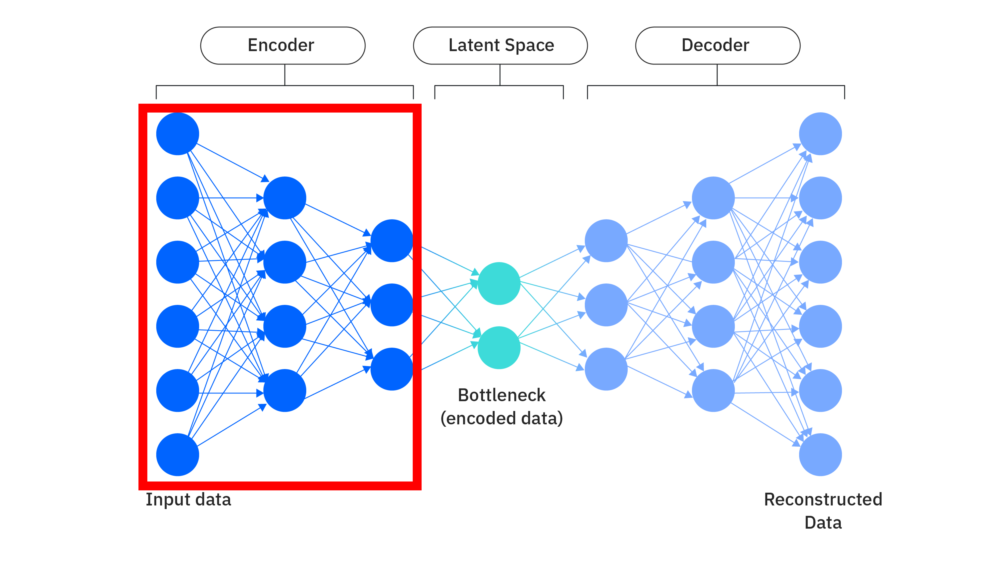
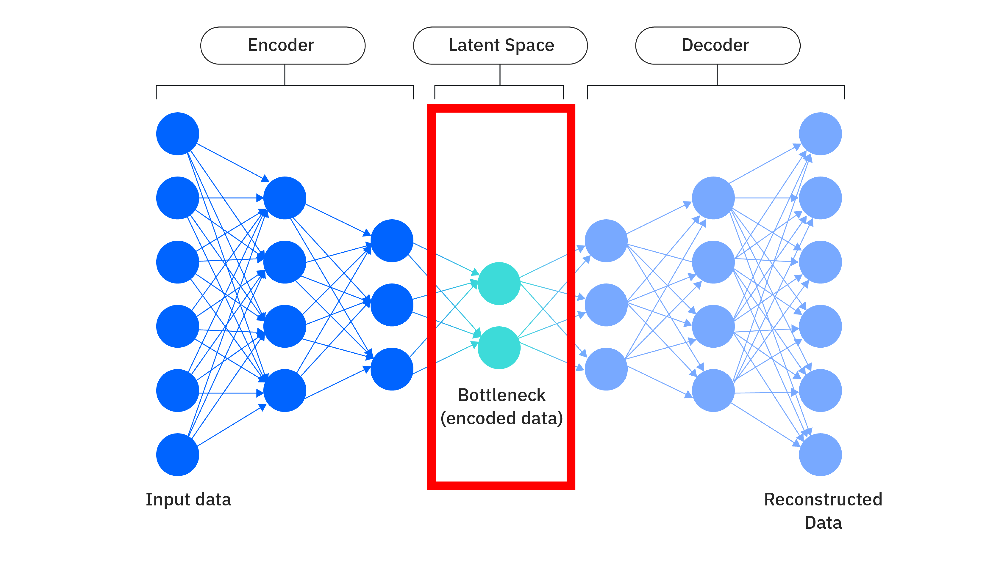
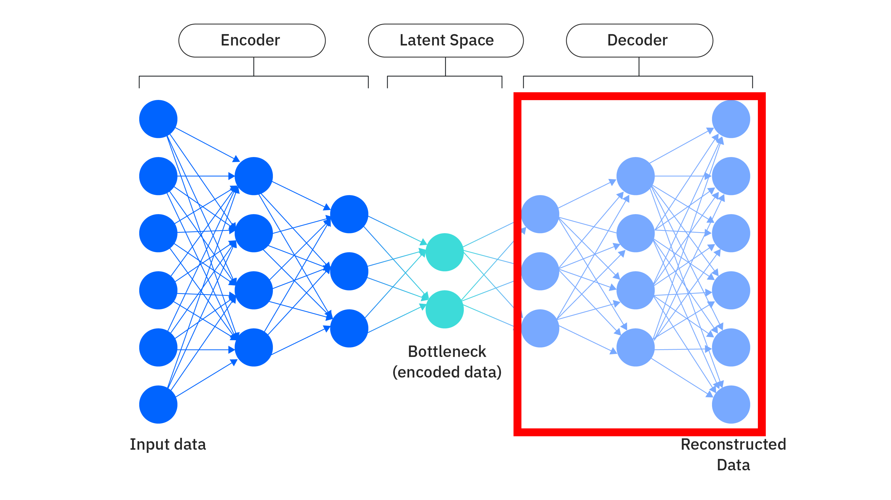
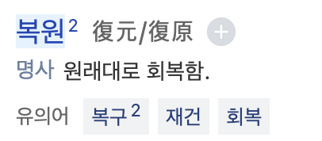
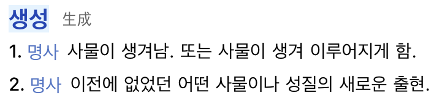
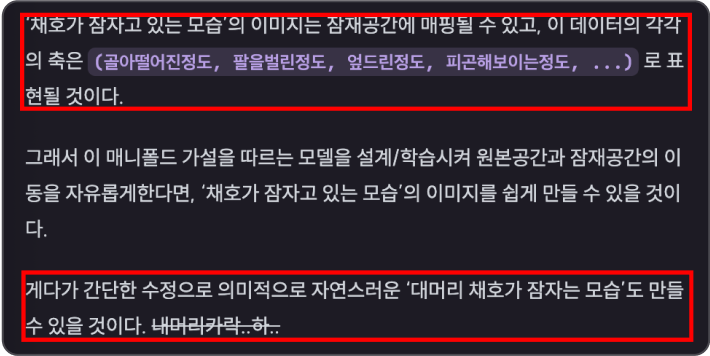
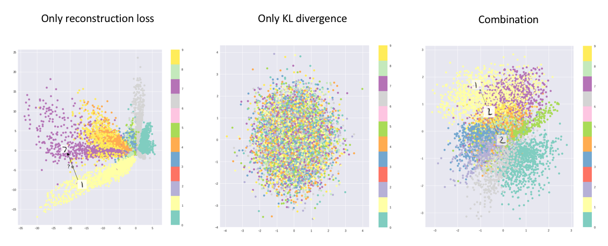

<!-- 그동안 포스트를 쓸 때 문체를 어떻게할까 고민했는데 아직도 어떻게 해야할지 모르겠다.. 그래서 일단 여러가지 스타일의 글을 두루두루 써보고 결정하기로 했습니다ㅎㅎ -->

생성모델에 대한 이야기 두 번째

저번 포스트에서는 생성모델의 근간이 되는 이론인 '매니폴드'에 대해서 알아보았습니다.

어떤 규칙이 있는 고차원 데이터가 저차원 공간인 **매니폴드/잠재공간** 에 매핑될 수 있는데, 
생성모델은 이 고차원 데이터를 잠재공간에 매핑시키는 것이 목표라고 설명드렸습니다.

이번에 은 오토인코더가 무엇인지, 오토인코더가 어떻게 고차원 데이터를 잠재공간에 매핑시키고 다시 복원하는지, 복원이 어떻게 생성과 연계되는지 알아보겠습니다.

---

AutoEncoder(오토인코더)는 신경망입니다. 
입력으로 들어온 데이터를 적은 차원으로 압축하고, 다시 복원하는 것을 목표로 설계 되었습니다.

위는 오토인코더의 신경망 구조를 시각화한 사진입니다.

노드의 수가 6개에서부터 점점 줄어들더니 bottleneck 부분에서 2개로 가장 적고, 그 다음부터는 점점 원래대로 다시 늘어나 6개가 되는 구조를 보이고 있습니다.

6개에서 2개로 줄어드는 부분은 고차원 원본 데이터를 잠재공간에 매핑하는 과정이고, 2개에서 6개가 되는 부분은 잠재공간에 있는 데이터를 다시 원본 데이터로 복원하는 과정입니다.

6개에서 2개가 되는 부분은 **Encoder(인코더)** 라고 부르고, 2개에서 6개가 되는 부분은 **Decoder(디코더)** 라고 부릅니다.  
2개인 부분은 **잠재공간(latent space)** 라고 부릅니다.

--- 

## Encoder(인코더)

빨간 부분이 **Encoder(인코더)** 입니다.

인코더는 고차원의 데이터를 점진적으로 차원을 줄여 최종적으로 저차원의 잠재공간에 매핑하는 역할을 합니다.

<!-- 원래는 이미지 데이터처럼 고차원 데이터였던 것도 인코더를 통과하고 나면 이미지의 주요 특징만 추출된 저차원 데이터로 바뀌게 됩니다. -->

$$
\mathbf{x} \in \mathbb{R}^n \\
\mathbf{z} = f_{\theta}(\mathbf{x}) \in \mathbb{R}^m, \quad m < n
$$

$n$차원 원본 데이터 $\mathbf{x}$가 인코더 $f_{\theta}$에 입력되면 $n$보다 작은 $m$차원 잠재공간 위의 데이터인 $z$가 출력됩니다.  
여기서 $\mathbf{x}$와 $	\mathbf{z}$는 실수범위의 수를 가지는 벡터로 표현됩니다.

이 과정을 **Encoding(인코딩)** 한다고 표현합니다.

---

## Latent Vector(잠재벡터)

인코더에서 나온 출력, $\mathbf{z}$입니다.

$n$차원인 원본 데이터보다 더 작은 $m$차원으로 표현됩니다.

---

## Decoder(디코더)

$$
\hat{\mathbf{x}} = g_{\phi}(\mathbf{z}) = g_{\phi}(f_{\theta}(\mathbf{x})) \in \mathbb{R}^n
$$

디코더 $g_{\phi}(\mathbf{z})$는 인코더에서 나온 잠재벡터 $z$를 다시 원본에 가까운 $\hat{\mathbf{x}}$로 복원하는 역할을 합니다. 
$\hat{\mathbf{x}}$은 $\mathbf{x}$와 마찬가지로 $n$차원의 실수 범위의 백터값입니다.

$\hat{\mathbf{x}}$은 $\mathbf{x}$와는 다르며, $	\mathbf{x}$에 근사시킨 값입니다.

--- 

이 오토인코더라는 신경망이 어떤 구조로 이루어져있는지는 어느정도 이해하셨을 겁니다.

하지만 의문이 드는게 하나 있습니다.

> "차원이 줄어들고 다시 늘어났을 뿐인데!!! 어떻게 데이터의 주요 특징구조를 포함한 잠재공간을 만들고, 어떻게 복원하는거죠?!?!?!"

그 이유를 알기 위해서 학습 방법을 알아야합니다.

---

## 학습 방법

### 학습 목표

오토인코더의 학습 목표는 $\mathbf{x}$를 입력했을 때, 출력 $\hat{\mathbf{x}}$가 $\mathbf{x}$와 비슷해지도록(근사, approximation) 하는 것이 목표입니다. 

  학습 목표 : 입력값과 출력값이 같아지도록 하는 것

결국 데이터에 라벨링이 되어있을 필요가 없기에 오토인코더의 학습은 비지도학습 혹은 자기지도학습(self-supervised learning)으로 분류 됩니다.

### Loss Function(손실함수)

손실함수도 학습 목표에 맞는, 특정 값에 근사할 수 있는 것을 사용합니다.

대표적으로 MSE(평균제곱오차, Mean Squared Error)를 사용합니다.

$$
\mathcal{L}(\mathbf{x}, \hat{\mathbf{x}}) = \frac{1}{n} \sum_{i=1}^{n} (x_i - \hat{x}_i)^2
$$

MSE에 대해서는 다들 잘 아실거라고 생각합니다.

### 학습 절차

오토인코더의 학습 절차는 아래와 같습니다.

1. 입력 $\mathbf{x}$를 인코더에 넣어 잠재벡터 $\mathbf{z} = f_\theta(\mathbf{x})$ 출력
2. 디코더를 통해 복원값 $\hat{\mathbf{x}} = g_\phi(\mathbf{z})$ 출력
3. 손실 함수 $\mathcal{L}(\mathbf{x}, \hat{\mathbf{x}})$ 계산  
4. 손실을 최소화하도록 파라미터 $\theta$, $\phi$를 업데이트  

이 절차를 반복하면서 오토인코더는 점점 학습데이터에 대한 복원을 잘하는 형태로 학습됩니다.

### 단순히 차원을 줄였는데 어떻게 특징을 학습하는가?

이전에 했던 질문입니다.

오토인코더를 제대로 학습 시킨 경우에는 인코더의 출력 $\mathbf{z}$는 디코더가 복원할 수 있는 형태로 이루어져 있습니다.

만약 디코더 없이 인코더만 학습 시켰다고 가정 해봅시다. 인코더의 출력은 어떤 의의를 가지게 될까요?

애초에 디코더가 없기에 학습 목표를 위한 손실함수를 적용할 수 없을테고, 출력 결과물에 정답이 없게 될테고, 인코더의 출력은... 
원본 입력의 데이터와 관계 없는, 아무 의미 없는 그저 차원만 줄인 데이터가 될 것입니다.

그럼 제대로 학습했다면요? 
바로 앞전에 설명했듯이 $\mathbf{z}$는 디코더가 복원할 수 있는 데이터이고, 제대로 학습했다면 디코더가 복원할 수 있는 $\mathbf{z}$가 인코더로 부터 잘 만들어질 것입니다.

$\mathbf{z}$는 원본데이터를 압축하고 다시 복원하는 과정에서 다른 사람이 보기엔 의미없는 데이터라도 우리가 **학습 시킨 디코더 관점에서는 의미 있는 데이터** 가 됩니다. 
왜냐하면, 디코더는 잠재벡터를 보고 원본 데이터를 추론할 수 있으니까요.

그래서 $\mathbf{z}$에는 원본 데이터로 복원할 수 있는 주요한 특징들이 포함되는 것입니다.

--- 

흐음..

잠재벡터에서 이미지를 그대로 복원하는 이 디코딩 과정이 과연 **생성** 이라고 할 수 있을까요? 
참고로 복원은 재구성(reconstruction)이라고도 부릅니다.

복원(復原)은 말 그대로 복원이고, **생성은 '이전에 없던 데이터를 만드는 행위'** 로 다르게 해석해야 합니다. 
단어 자체로도 다른 뜻이고, 특히 생성모델 관점에서는 엄연히 분리되는 개념이니 헷갈리시면 안됩니다.

 

이 오토인코더는 오로지 복원을 위해서 설계, 학습 되었습니다.

그럼 이전에 없던 데이터를 만드는 것은 어떻게 할 수 있을까요?  
이전 포스트에서도 예시로 간략하게 설명했습니다.

잠재벡터의 값은 이미지를 복원하기 위한 특징값들이기 때문에 이 값들을 조정한다면 입력값과 다른 이미지가 출력으로 나오게 됩니다.

이전에 없는 데이터가 나오도록 잠재벡터를 조정하여 디코딩한다면 이는 데이터가 **'생성'** 된 것이라고 볼 수 있을 것입니다.

 

문제는 이 오토인코더는 오로지 복원을 위해서 설계되었기 때문에 잠재벡터를 그냥 아무렇게 조정한다고 인간에게 유의미한 결과가 나오기 힘들다는 것입니다.

위 사진은 오토인코더의 손실함수별 잠재공간의 데이터 분포에 대한 사진입니다. 
왼쪽이 방금 소개한 오토인코더에 복원(재구성)을 위한 손실만 사용했을 때의 분포입니다.

여기서 만약 '복원을 x위한 손실만 사용한 오토인코더'에서 어느 잠재벡터 값을 미세하게 이동시켜서 복원했을 때, 과연 그 학습데이터의 경향을 따르는 벡터는 유의미한 데이터일까요?

아닐 가능성이 커보이는 것은 옆의 사진의 Only KL Divergence, Combination 그래프를 보면 이해할 수 있습니다.

왼쪽의 Only Reconstruction Loss의 데이터 분포는 고르지 않습니다. 비어있는 부분도 많습니다.

생성을 위해서 잠재벡터를 이동시켰다고 한들, 그곳이 학습시에 비어있는 공간이었다면 의미 없는 데이터가 나올 가능성이 큽니다.

그래서 생성을 위해서는 이 잠재공간의 데이터분포를 고르고 촘촘하게 만들어야합니다.

이 잠재공간의 데이터분포를 고르고 촘촘하게 만드는 방법은 다음 포스트에서 설명드리겠습니다.

---

이번 포스트에서는 오토인코더가 무엇인지, 복원과 생성에 대한 기본 개념을 알아보았습니다.

긴 글 읽어주셔서 감사합니다 :)

아 그리고! 그동안 포스트를 쓸 때 문체를 어떻게할까 고민했는데 아직도 어떻게 해야할지 모르겠습니다... 굉장히 어렵네요..  
그래서 일단 여러가지 스타일의 글을 두루두루 써보고 결정하기로 했습니다ㅎㅎ

---