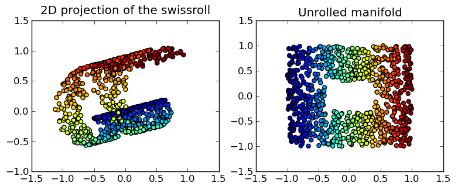
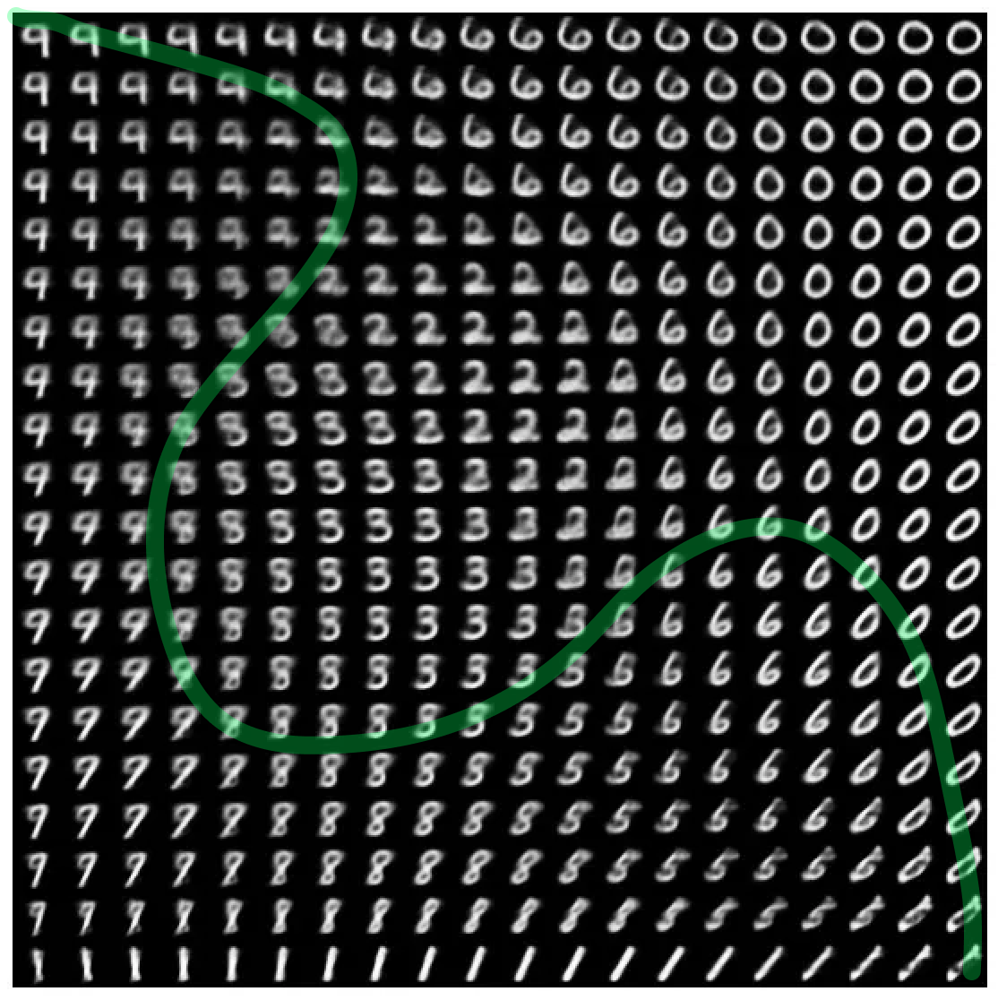
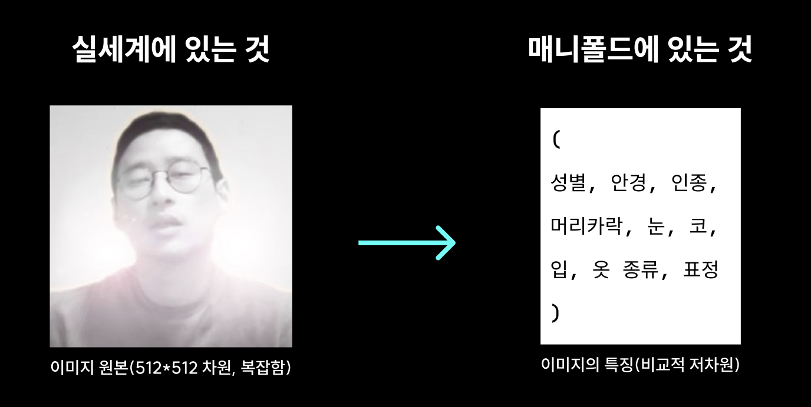
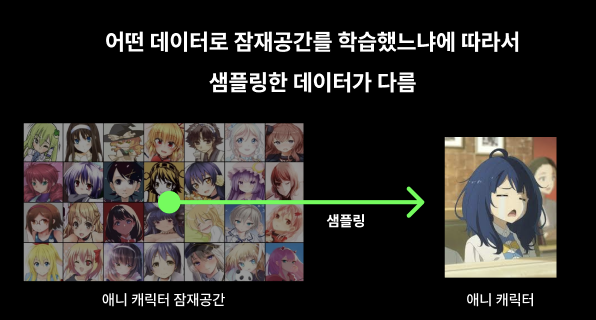

이번에는 내가 지금까지 인공지능에 대해서 공부하면서 가장 흥미롭다고 느낀 것을 간략하게 설명하려고 한다.

이것에 대한 궁금증은 생성모델으로부터 시작된다...

<br>

> "흠.. 내가 쓰고 있는 이미지 생성모델의 출력은 768*768인데 이 정도 해상도 크기면 이미지를 뽑는 경우의 수가 무한할텐데.. 어떻게 저렇게 내가 원하는 이미지만 쏙쏙 뽑아낼까?"

이런 질문은 어떻게 보면 간단하게 대답할 수 있다.

> "그건 이미지 생성모델이 당신이 제공하는 조건에 맞게 여러 단계를 거쳐서 노이즈를 제거하면서 이미지를 만들어냈기 때문이에요."

그런데 이런 답변은 내 궁금증을 해소하기 어려웠다.

> "아니!!! 그렇다면!! 어떻게 내가 제공한 조건에 맞게 **필요한 노이즈** 만 제거한 것인가요?"

내가 궁금했던 내용과 원하는 답변은 ***매니폴드*** 라는 개념에서 찾을 수 있었다.

> "이미지 생성모델은 주어진 조건에 맞춰 어떤 노이즈를 제거해야 할지를 결정하는 **매니폴드** 를 학습했기 때문입니다."

---

픽셀이 한 개 있다고 해보자, 이 경우에는 1차원으로 픽셀 1개의 밝기를 모두 표현할 수 있을 것이다.
```
(0): 검정색, (0.5): 회색, (1): 하얀색
```

그럼 두 개는? 이 경우에는 2차원으로 밝기를 표현할 수 있다.
```
(0,0), (1,0), (0,1), (1,1), (0.5,0.5)
```

그럼 세 개는? 이 경우에는 3차원으로 밝기를 표현할 수 있다.
```
(0,0,0), (1,0,0), (1,1,1), (0.5,1,0.5)
```

픽셀들의 집합, 즉 이미지는 이런 식으로 **벡터 공간의 한 점**에 대응될 수 있다.

위에서 이야기했던 768*768 크기의 이미지도 벡터 공간의 한 점에 대응될 수 있을 것이다.

<br>

사람에게 3차원 공간에서 하얀색 이미지를 하나 뽑아달라고 요청했을 때, 어렵지 않게 바로 이미지를 뽑아낼 것이다.
```
(1,1,1)
```
3차원 공간은 좌표계를 사용해서 직관적으로 이해할 수 있을 만큼 단순하기 때문이고, '하얀색 이미지'도 생각하기 어렵지 않기 때문이다.


<br>

그렇다면 아까의 예시로 사람에게 768 * 768 * 3의 공간에서 '채호가 잠자고 있는 모습'의 이미지를 뽑아달라고 하면 어떨까?
```
(0,1,0.2,0.3,0.9,1,0,0.2,0,0,0,0.1,0.7,0.8,0.9,0.3 ... 0.3)
```
1,769,472차원에서 '채호가 잠자고 있는 모습'의 이미지를 뽑기란 상당히 힘들 것이다... 머리가 터지는 수준을 넘어 계산이 불가능하다. <br>
사람은 물론 각각이 차원이 실수 범위인 이 이미지 데이터는 컴퓨터도 계산하기 힘들어 보인다.

---

여기서 **매니폴드 가설** 은 1,769,472차원을 다 쓰지 않더라도 '채호가 잠자고 있는 모습'을 표현할 수 있는 방법을 제시한다.

매니폴드 가설을 간략하게 설명하자면...<br>
***매니폴드란 고차원 공간에 존재하는 데이터가 사실은 더 낮은 차원에 놓여있다는 것이고,***<br>
***매니폴드 가설은 대부분의 자연적인 고차원 데이터가 저차원 구조인 매니폴드 위에 존재한다고 보는 가설이다.***

<br>

이 매니폴드를 설명할 때 자주 사용되는 예시가 바로 **스위스롤** 이다.

<div style="display: flex; justify-content: center;">


</div>

롤빵은 본질적으로 2차원 평면에서 존재하는 데이터를 돌돌 말아서 3차원 공간에 표현한 것이라고 볼 수 있다. <br>
3차원 공간에서 돌돌 말린 롤빵을 이걸 잘 펼쳐서 다시 2차원 공간 위에 놓을 수 있다.



왼쪽 사진은 스위스롤의 원본 공간(3차원 데이터)에서의 모습을 시각화한 것이고, 오른쪽 사진은 스위스롤의 본질을 담은 매니폴드 공간 위에서의 모습을 시각화 한 것이다.

차원이 2차원에서 3차원으로 3차원에서 2차원으로 달라졌지만, 데이터의 본질적인 구조는 그대로 유지되었다.

---

바로 이게 생성모델이 하려는 일이고, 생성모델 설계의 가장 근본적인 목표인데, **고차원 공간에 분포된 데이터들에서 내재된 저차원 구조를 파악**하는 것이다.<br>
다른 말로는 **고차원 데이터를 저차원의 매니폴드 공간에 효과적으로 대응되도록 학습시키는 것** 이 목표라고 볼 수 있겠다.

생성모델을 다룰 때에는 매니폴드를 **잠재공간(latent space)** 라고 부르고, 매니폴드 위에 놓여진 벡터 데이터를 **잠재벡터(latent vector)** 라고 부른다.<br>

<div style="display: flex; justify-content: center;">



</div>
잠재공간의 흥미로운 특징을 알 수 있는 사례가 있어서 사진을 하나 가져왔다. <br>
위 사진은 mnist 데이터셋을 2차원 잠재공간에 매핑시켜 위치에 맞게 배치한 사진이다.

바로 데이터의 변화가 부드럽고 연속된다는 것이다. 

제일 위의 행을 보면 9에서 0으로 바뀌는 부분이 9에서 6에서, 6에서 0까지 스무스하게 바뀌는 것을 볼 수 있다. <br>
각 숫자가 명확한 부분이 있고, 무슨 숫자인지 알아보기 어려운 부분있는데, 표시한 곡선을 잘 보면 선 위에 놓인 데이터는 연속적으로 바뀌는 것을 볼 수 있다.<br>
이 곡선 위에 표시된 데이터들 중에서 무슨 숫자인지 알 수 없는 일부는 mnist 데이터셋에 실제로 없는 잠재공간이 생성한 데이터일 것이다.

하지만 이 연속은 단순히 **이미지 형태만의 연속** 을 의미하는 것이 아니다.<br> 
잠재공간이 흥미로운건 잠재공간에서 움직인 데이터는 **의미도 연속** 된다는 것이다.<br>
원본공간에서 잠재공간으로의 변환은 단순히 차원만 축소된 것으로 볼 것이 아니다.

<br>

이해하기 어려울 수 있을 수 있으니... 예를 들어서 사람 이미지를 표현하는 잠재벡터가 있다고 하자.



이 잠재벡터에는 사람을 표현하는 각종 정보들이 각각의 축으로 표현되어있다.

예를 들어서 눈의 크기를 나타내는 축의 값을 바꾼다고 해보자, 값이 0인 사람은 눈이 매우 작을 것이고, 0.3인 사람은 눈이 작을 것이고, 0.5인 사람은 평균, 0.8인 사람은 크고, 1인 사람은 매우 클 것이다.

(눈의 크기, 코의 크기)를 (1,1)로 하면 눈과 코가 매우 큰 사람이고, (0,1)로 하면 눈은 매우 작지만 코가 매우 큰 사람일 것이다.

**의미도 연속** 된다는 것은 이런 것이다.

<br>


여기서 성별이나 인종 등을 표현하는 축의 값을 조정한다면 위의 사진과 같이 실제 학습된 값들 사이에 있는 존재하지 않는 데이터를 뽑아낼 수 있는 것이다.

<br>

이런식으로 실제 사람의 얼굴을 표현하는 잠재공간에서 애니메이션 그림체 캐릭터의 얼굴을 뽑고 싶다고 했을 떄, 원하는 이미지가 출력 될까?

<div style="display: flex; justify-content: center;">



</div>

명확하게 표현되지 않을 가능성이 높다. 왜냐하면 이 잠재공간에서의 데이터는 실제 사람의 얼굴을 표현하는 축으로만 이루어졌기 떄문이다.

그렇기에 잠재공간에서 표현 가능한 정도는 어느 데이터를 학습 시키느냐에 따라 달려있다.

---


이해가 되었다면 어느정도 감이 잡힐 것이다.

'채호가 잠자고 있는 모습'의 이미지는 잠재공간에 매핑될 수 있고, 이 데이터의 각각의 축은 `(골아떨어진정도, 팔을벌린정도, 엎드린정도, 피곤해보이는정도, ...)` 로 표현될 것이다.

그래서 이 매니폴드 가설을 따르는 모델을 설계/학습시켜 원본공간과 잠재공간의 이동을 자유롭게한다면, '채호가 잠자고 있는 모습'의 이미지를 쉽게 만들 수 있을 것이다.

게다가 간단한 수정으로 의미적으로 자연스러운 '대머리 채호가 잠자는 모습'도 만들 수 있을 것이다. ~내머리카락..하..~


---

이번에는 생성모델이 어떻게 고차원 데이터를 만들어낼 수 있는지 그 근간을 알아보았다.

다음에는 실제 신경망 모델의 예시를 들어서 어떻게 이미지 데이터를 잠재공간에 매핑시키고 다시 복원하는지 알아보겠다.

다음은 VAE에 대한 글로 돌아오겠다.


---

잠재공간에 대해서 처음 공부할 때 아래의 게시물을 참고하였습니다. 좋은 글 작성해주셔서 감사합니다 (꾸벅)

https://arca.live/b/alpaca/106037905

제 글을 읽고서 잘 이해가 안되는 분이 있다면, 이 글도 같이 읽어보시면 도움이 될 것입니다.