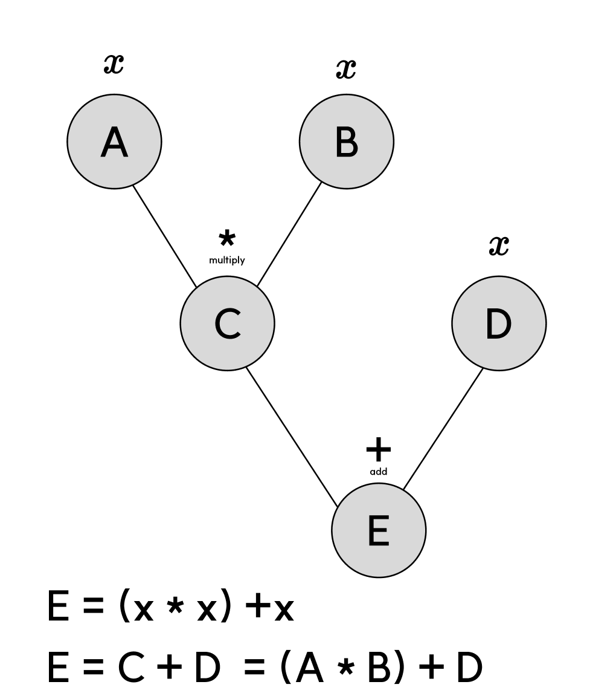

최적화 분야에서는 미분이 필수적으로 사용된다.  
최솟값을 구함으로써 최적화를 위한 비용을 줄일 수 있는 경우가 많기 때문이다.

최적화의 대표적인 예로 **경사하강법**이 있는데, 미분을 어떻게 사용하는지 잘 보여주는 예시이다. 
 
경사하강법은 신경망의 $(\text{정답값} - \text{예측값})$을 나타내는 손실 함수의 최소값을 찾는 것이 목적이다.  
손실 함수의 최소가 갖는 의의는 $(\text{정답값} - \text{예측값})$이 최소일 때, 즉 예측이 가장 정확할 때를 의미한다.  
그래서 손실 함수의 최소를 찾는 것이다.

그렇다면 손실 함수의 최소를 어떻게 찾을까? 
우리는 이미 수학 II, 미적분 시간에 함수의 최소를 구하는 방법을 배웠다. 기울기가 $0$이면서 좌, 우의 $y$값보다 작은 지점이 최소가 된다. 
이 원리는 경사하강법에도 똑같이 적용된다.

그런데 한 가지 문제가 있다. 

우리는 기울기가 $0$인 지점을 구할 때 인수분해하거나 식을 조작하는 방법으로 찾았지만, 컴퓨터에 같은 방식을 적용하기에는 경우의 수가 너무 많아 그렇게 할 수 없다.  
예를 들어 $y' = x^2 + 2x + 1$을 완전제곱식으로 고쳐서 바로 $y' = 0$이 되는 $x$를 구하는 건 계산에 익숙해진 인간만 가능한 일이다.

---

그래서 컴퓨터로 미분을 할 때에는 다른 방법을 사용해야 한다.

크게 두 가지 예시가 있는데,  
첫 번째는 우리가 이미 고등학교 수업 시간에 도함수의 정의에서 배운 `수치 미분(numerical differentiation)` 을 프로그램으로 구현하는 것이고, 두 번째는 `자동 미분(automatic differentiation)` 이다.

수치 미분을 프로그램으로 구현하는 건 매우 간단하다.  
$$
\frac{f(x+h) - f(x-h)}{2h}
$$
여기서 $h$를 $0.001$과 같이 매우 작은 값으로 두고 계산하면, $\lim$ 기호 없이도 미분을 근사할 수 있다.

그런데 이러한 수치 미분 구현에는 심각한 문제점이 있다.  
$h$를 너무 크게 두면 값이 부정확할 수 있고, $h$를 너무 작게 두면 부동소수점 특성상 오차가 발생한다.  
또한, 함수의 변수 개수(차원)가 늘어날수록 계산 복잡도가 기하급수적으로 증가한다.

이러한 문제를 해결한 것이 자동 미분이다.  
자동 미분은 함수를 가장 기본적인 연산의 합성 형태로 바꿔, 연쇄 법칙(chain rule)을 활용해서 미분하는 방식이다.

---

이해하기 어려울 수 있으니 예시를 설명하겠다.

예를 들어 함수 $f(x) = x^2 + x$ 가 있다고 하자.  
이 함수를 다음과 같이 표현할 수 있다.

$f(x) = \text{add}(x^2, x) = \text{add}(\text{mul}(x, x), x)$

위와 같이 함수의 연산 관계를 나타낸 그래프를 활용하면 자동 미분에 대한 직관적 이해가 쉽다. 
자동 미분에는 forward와 backward가 있지만, 여기서는 **backward(역전파)** 에 대해 설명한다. 
기본 아이디어는 함수의 최종 노드 $E$에서 그래프의 끝에 있는 $A, B, D$까지 chain rule로 연결해서 미분하는 것이다.

$x$에 $2$가 들어간다고 생각하고, $E$부터 시작해보자.

1. 가장 먼저 $E$를 $E$에 대해 미분하면
   $$
   \frac{d E}{d E} = 1
   $$

2. 그 다음 $C$와 $D$에 대해 미분한다.
   $$
   \frac{d E}{d C} = \frac{d E}{d E} \cdot \frac{\partial E}{\partial C} = 1 \times 1 = 1
   $$
   $$
   \frac{d E}{d D} = \frac{d E}{d E} \cdot \frac{\partial E}{\partial D} = 1 \times 1 = 1
   $$

3. 이어서 $C$의 이전 노드 $A$와 $B$에 대해 미분한다.  
   $C = A \times B$이므로
   $$
   \frac{\partial C}{\partial A} = B = 2, \quad \frac{\partial C}{\partial B} = A = 2
   $$
   $$
   \frac{d E}{d A} = \frac{d E}{d C} \cdot \frac{\partial C}{\partial A} = 1 \times 2 = 2
   $$
   $$
   \frac{d E}{d B} = \frac{d E}{d C} \cdot \frac{\partial C}{\partial B} = 1 \times 2 = 2
   $$

4. 모든 미분이 끝났으므로,
   $$
   \frac{d E}{d A} + \frac{d E}{d B} + \frac{d E}{d D} = 2 + 2 + 1 = 5
   $$

5. 실제 미분값 $f'(x) = 2x + 1$에서 $f'(2) = 5$가 나오므로, 결과가 동일함을 확인할 수 있다.

---

이 예시에서는 덧셈, 곱셈만 사용되었지만 실제로는 $\exp$, $\log$의 미분부터 ReLU, Sigmoid 같은 복잡한 함수의 미분도 구현해야 한다.

자동 미분은 이러한 연산을 미리 구현해두고 필요할 때 가져다 쓰는 식으로 동작한다.

---

::github{repo="GonGe1018/python-differentiation"}

위 repo에서 간단한 자동 미분 구현체를 볼 수 있다!

---